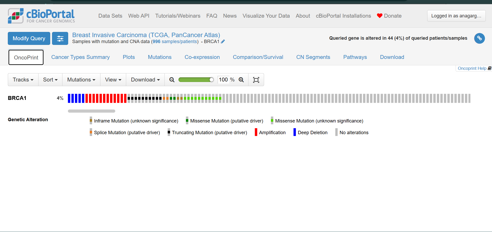

# BRCA1 Cancer Project – My First Genomics Analysis

**Ana Garg** – B.Sc Life Sciences, Amity University  
May 2026

---

## What is this?

I did this project on my own to learn how cancer databases work. I wanted to see if I could find real mutations in breast cancer patients and then check what doctors say about them. This is for my resume and to show I'm serious about oncology research.

---

## What I found

- In **996 breast cancer patients** from TCGA data, BRCA1 had a mutation in **44 patients (4%)**.
- The most common mutation types were truncating and missense (the bad kinds).
- I picked one specific mutation: `c.68_69del (p.Glu23fs)`.
- On ClinVar, it is labelled **Pathogenic** – meaning it definitely causes cancer.
- The review was done by a **ClinGen expert panel in June 2024**, so it's legit.

---

## 📸 Screenshots And PDFS 

### cBioPortal OncoPrint – BRCA1 altered in 4% of patients

### ClinVar – Pathogenic classification

---

## Tools I used

- **cBioPortal** – to get the mutation frequency and the colorful OncoPrint
- **ClinVar** – to check if the mutation is dangerous

---

## How I did it (quick steps)

1. Went to cBioPortal, selected breast cancer study (TCGA)
2. Typed BRCA1, clicked query – got the OncoPrint
3. Saw that 4% of patients had alterations
4. Went to ClinVar, searched for `BRCA1 c.68_69del`
5. Found it labelled Pathogenic by expert panel

---

## Why I did this

I'm applying for internships in cancer research and molecular diagnostics. I wanted to show that I can actually use these databases, not just watch tutorials. Also I genuinely wanted to understand how people find mutations linked to cancer.

---

## What I learned

- Not all mutations are the same – some are harmless, some are pathogenic
- cBioPortal is pretty easy to use once you figure it out
- ClinVar has a weird search system (it didn't like "185delAG" at first)
- I need to learn more about how to interpret different types of variants

---

## Files in this repo

| File | Description |
|------|-------------|
| `cBioPortal_BRCA1_OncoPrint.png` | Screenshot of OncoPrint showing 4% alteration frequency |
| `ClinVar_BRCA1_c.68_69del_Pathogenic.pdf` | Pdf file of ClinVar entry showing Pathogenic |
| `Project_Summary_Report.pdf` | One-page written summary of methods and findings |
| `README.md` | This file |

---

## Links

- [My GitHub Profile](https://github.com/AnaGarg96)
- [cBioPortal](https://www.cbioportal.org/)
- [ClinVar](https://www.ncbi.nlm.nih.gov/clinvar/)

---

*This is a self-directed project completed to learn cancer genomics databases. Open to feedback and internship opportunities in oncology research.*
